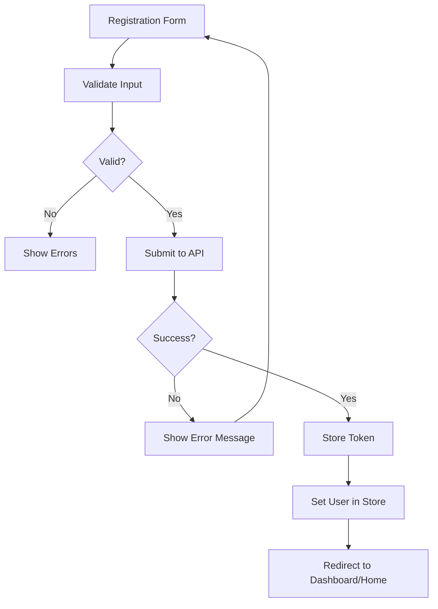
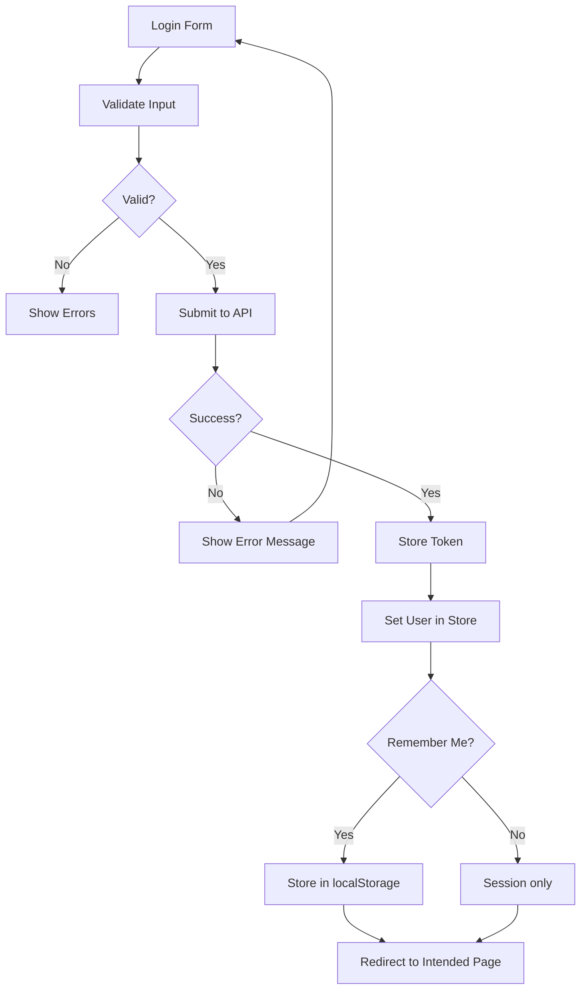

# Authentication Feature

## Overview
User authentication allows customers to create accounts, log in, and access personalized features like order history and saved addresses.

## User Stories

### As a Customer
- I want to create an account so I can save my delivery information
- I want to log in to access my order history
- I want to stay logged in across sessions (remember me)
- I want to reset my password if I forget it
- I want to update my profile information
- I want to log out securely

### As a Guest
- I want to place orders without creating an account (guest checkout)
- I want to track my order using just the order number

## Authentication Strategy

### JWT-Based Authentication
- Server issues JWT token on successful login
- Token stored in httpOnly cookie (preferred) or localStorage
- Token included in Authorization header for protected requests
- Token refresh mechanism for long-lived sessions

## Components

### LoginView.vue
**Location**: `src/views/LoginView.vue`
**Purpose**: Login page

**Features**:
- Email/password form
- "Remember me" checkbox
- "Forgot password" link
- Link to registration page
- Social login buttons (future)

### RegisterView.vue
**Location**: `src/views/RegisterView.vue`
**Purpose**: User registration page

**Form Fields**:
- Name (required)
- Email (required)
- Phone (required)
- Password (required, min 8 chars)
- Password confirmation (required)
- Terms acceptance checkbox

### ProfileView.vue
**Location**: `src/views/ProfileView.vue`
**Purpose**: User profile management

**Sections**:
- Personal information
- Saved delivery addresses
- Order history
- Payment methods (future)
- Preferences

### ForgotPasswordView.vue
**Location**: `src/views/ForgotPasswordView.vue`
**Purpose**: Password reset request

### ResetPasswordView.vue
**Location**: `src/views/ResetPasswordView.vue`
**Purpose**: Password reset with token

## State Management

### userStore (Pinia)
```javascript
{
  state: {
    user: null,              // Current user object
    isAuthenticated: false,   // Auth status
    token: null,             // JWT token
    loading: false,
    error: null
  },

  getters: {
    isLoggedIn: (state) => state.isAuthenticated && state.user !== null,
    userName: (state) => state.user?.name || 'Guest',
    userEmail: (state) => state.user?.email
  },

  actions: {
    async register(userData),
    async login(credentials),
    async logout(),
    async fetchCurrentUser(),
    async updateProfile(updates),
    async changePassword(oldPassword, newPassword),
    async requestPasswordReset(email),
    async resetPassword(token, newPassword),
    setUser(user),
    clearUser()
  }
}
```

## API Integration

### Register
```javascript
POST /auth/register
{
  "name": "John Doe",
  "email": "john@example.com",
  "password": "securePassword123",
  "phone": "+1234567890"
}

Response: 201 Created
{
  "user": { ... },
  "token": "jwt_token_here"
}
```

### Login
```javascript
POST /auth/login
{
  "email": "john@example.com",
  "password": "securePassword123"
}

Response: 200 OK
{
  "user": { ... },
  "token": "jwt_token_here"
}
```

### Get Current User
```javascript
GET /auth/me
Authorization: Bearer {token}

Response: 200 OK
{
  "id": "user_123",
  "name": "John Doe",
  "email": "john@example.com",
  "phone": "+1234567890"
}
```

### Update Profile
```javascript
PATCH /auth/profile
Authorization: Bearer {token}
{
  "name": "John Smith",
  "phone": "+9876543210"
}

Response: 200 OK
```

### Change Password
```javascript
POST /auth/change-password
Authorization: Bearer {token}
{
  "oldPassword": "currentPassword",
  "newPassword": "newSecurePassword123"
}

Response: 200 OK
```

### Request Password Reset
```javascript
POST /auth/forgot-password
{
  "email": "john@example.com"
}

Response: 200 OK
{
  "message": "Password reset email sent"
}
```

### Reset Password
```javascript
POST /auth/reset-password
{
  "token": "reset_token_from_email",
  "newPassword": "newSecurePassword123"
}

Response: 200 OK
```

## Authentication Flow

### Registration Flow


### Login Flow


### Auto-Login on App Load
```javascript
// main.js or App.vue
onMounted(async () => {
  const token = localStorage.getItem('auth_token')
  if (token) {
    try {
      const user = await apiClient.get('/auth/me')
      userStore.setUser(user.data)
      userStore.token = token
      userStore.isAuthenticated = true
    } catch (error) {
      // Token invalid, clear it
      localStorage.removeItem('auth_token')
    }
  }
})
```

## Route Guards

### Protected Routes
```javascript
// router/index.js
router.beforeEach((to, from, next) => {
  const userStore = useUserStore()

  if (to.meta.requiresAuth && !userStore.isLoggedIn) {
    // Redirect to login, save intended destination
    next({
      name: 'login',
      query: { redirect: to.fullPath }
    })
  } else if (to.meta.requiresGuest && userStore.isLoggedIn) {
    // Already logged in, redirect to home
    next({ name: 'home' })
  } else {
    next()
  }
})
```

### Route Meta
```javascript
{
  path: '/profile',
  name: 'profile',
  component: ProfileView,
  meta: { requiresAuth: true }
},
{
  path: '/login',
  name: 'login',
  component: LoginView,
  meta: { requiresGuest: true }
}
```

## Form Validation

### Password Requirements
- Minimum 8 characters
- At least one uppercase letter
- At least one lowercase letter
- At least one number
- Optional: Special character

### Email Validation
- Valid email format
- Check for uniqueness (on backend)

### Phone Validation
- Valid phone number format
- International format support

## Security Best Practices

### Password Storage
- Never store plain text passwords
- Use bcrypt/argon2 for hashing (backend)

### Token Security
- Use httpOnly cookies when possible
- Set secure flag in production
- Implement token expiration
- Refresh token mechanism

### Input Sanitization
- Escape user inputs
- Validate on both client and server
- Prevent SQL injection (backend)
- Prevent XSS attacks

### Rate Limiting
- Limit login attempts (e.g., 5 per 15 minutes)
- CAPTCHA after failed attempts
- Account lockout after multiple failures

## UI Specifications

### Login Form
```vue
<form @submit.prevent="handleLogin" class="max-w-md mx-auto">
  <div class="mb-4">
    <label class="block text-sm font-medium mb-1">Email</label>
    <input
      type="email"
      v-model="email"
      required
      class="w-full px-4 py-2 border rounded-lg focus:ring-2 focus:ring-red-600"
    />
  </div>
  <div class="mb-4">
    <label class="block text-sm font-medium mb-1">Mot de passe</label>
    <input
      type="password"
      v-model="password"
      required
      class="w-full px-4 py-2 border rounded-lg focus:ring-2 focus:ring-red-600"
    />
  </div>
  <div class="mb-4 flex items-center justify-between">
    <label class="flex items-center">
      <input type="checkbox" v-model="rememberMe" class="mr-2" />
      <span class="text-sm">Se souvenir de moi</span>
    </label>
    <RouterLink to="/forgot-password" class="text-sm text-red-600 hover:underline">
      Mot de passe oublié?
    </RouterLink>
  </div>
  <button
    type="submit"
    :disabled="loading"
    class="w-full bg-red-600 text-white py-3 rounded-lg font-medium hover:bg-red-700"
  >
    {{ loading ? 'Connexion...' : 'Se connecter' }}
  </button>
</form>
```

### User Menu (Header)
```vue
<div v-if="userStore.isLoggedIn" class="relative">
  <button @click="toggleUserMenu" class="flex items-center gap-2">
    <span>{{ userStore.userName }}</span>
    <svg class="w-5 h-5"><!-- Dropdown icon --></svg>
  </button>

  <div v-if="showUserMenu" class="absolute right-0 mt-2 w-48 bg-white shadow-lg rounded-lg">
    <RouterLink to="/profile" class="block px-4 py-2 hover:bg-gray-100">
      Mon profil
    </RouterLink>
    <RouterLink to="/orders" class="block px-4 py-2 hover:bg-gray-100">
      Mes commandes
    </RouterLink>
    <button @click="handleLogout" class="block w-full text-left px-4 py-2 hover:bg-gray-100">
      Déconnexion
    </button>
  </div>
</div>
```

## Error Messages

### User-Friendly Errors
- "Email ou mot de passe incorrect" (don't specify which)
- "Cet email est déjà utilisé"
- "Le mot de passe doit contenir au moins 8 caractères"
- "Une erreur s'est produite. Veuillez réessayer."

## Accessibility

- Proper form labels
- Error messages announced to screen readers
- Focus management
- Keyboard navigation
- Password visibility toggle

## Testing Checklist

- [ ] Registration with valid data succeeds
- [ ] Registration with duplicate email fails
- [ ] Login with correct credentials succeeds
- [ ] Login with incorrect credentials fails
- [ ] "Remember me" persists across sessions
- [ ] Logout clears user data and token
- [ ] Protected routes redirect to login
- [ ] Auto-login works on app reload
- [ ] Password reset email sent
- [ ] Password reset with token works
- [ ] Profile update succeeds
- [ ] Password change succeeds

## Future Enhancements

- [ ] Social login (Google, Facebook)
- [ ] Two-factor authentication (2FA)
- [ ] Email verification
- [ ] Account deletion
- [ ] Session management (view active sessions)
- [ ] OAuth integration for third-party apps
