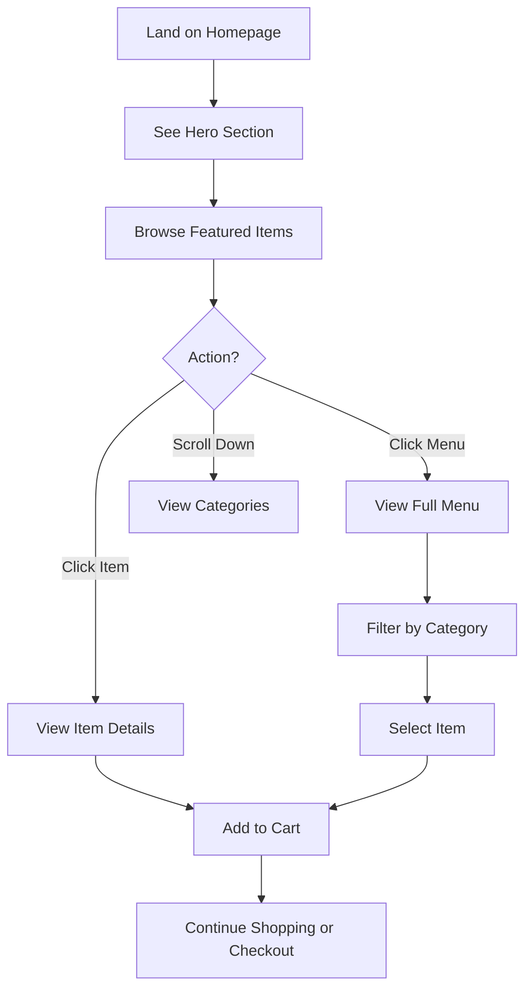
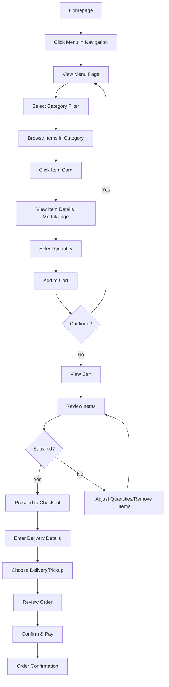
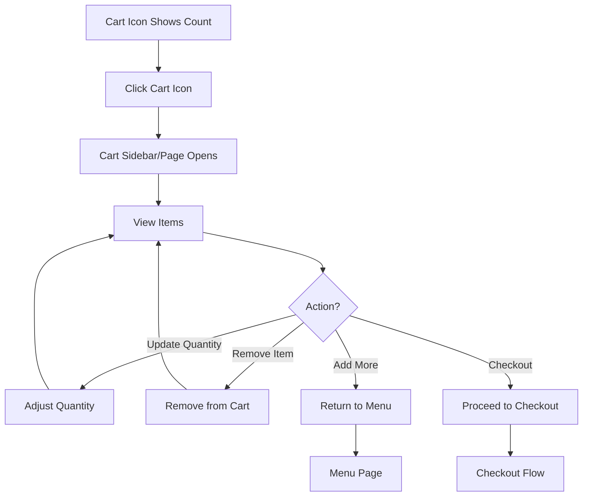
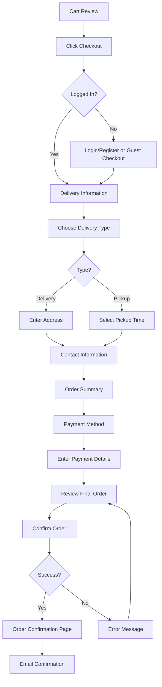
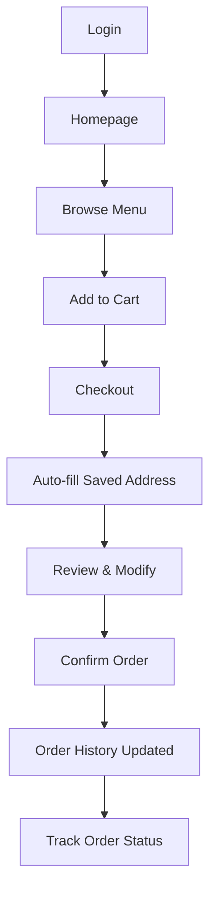
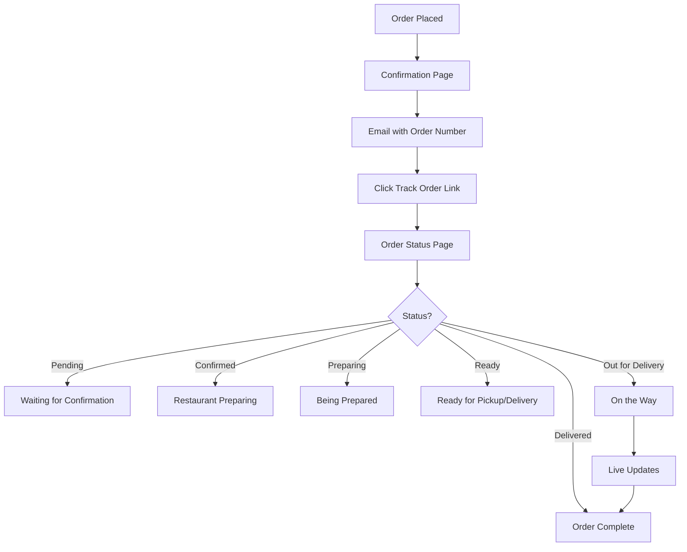
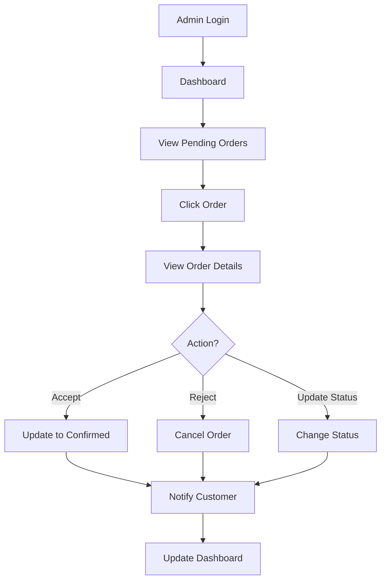
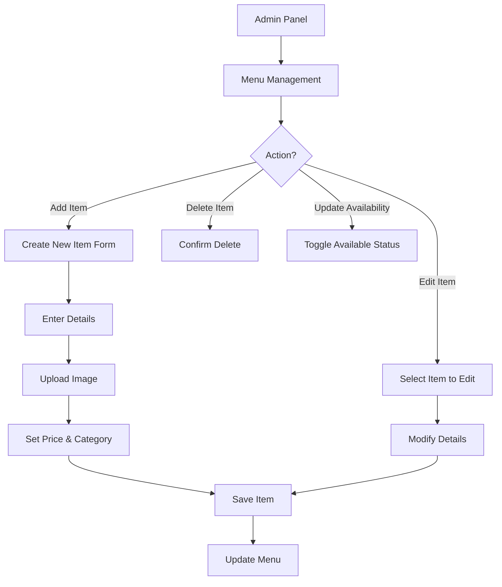

# User Flows

This document outlines the key user journeys and interaction flows for Kamili Food.

## 1. First-Time Visitor Flow

**Steps**:
1. User arrives at homepage
2. Sees announcement banner "La commande est ouverte"
3. Views hero section with main CTA
4. Scrolls to browse menu categories or featured items
5. Clicks on item to view details
6. Adds item to cart
7. Can continue shopping or proceed to checkout

## 2. Browse & Order Flow

**Key Decision Points**:
- Category selection
- Add to cart vs. continue browsing
- Delivery vs. pickup
- Order confirmation

## 3. Cart Management Flow

**Cart Features**:
- Real-time total calculation
- Item quantity adjustment
- Remove items
- Visual feedback for changes
- Persistent across sessions (if logged in)

## 4. Checkout Flow

**Checkout Steps**:
1. Authentication (optional for guest checkout)
2. Delivery type selection
3. Address/pickup details
4. Contact information
5. Payment
6. Confirmation

## 5. Registered User Flow

**Benefits for Registered Users**:
- Saved delivery addresses
- Order history
- Faster checkout
- Favorites/saved items (future)
- Loyalty points (future)

## 6. Order Tracking Flow

**Order Statuses**:
1. Pending - Order received
2. Confirmed - Restaurant accepted
3. Preparing - Food being made
4. Ready - Ready for pickup
5. Out for Delivery - Driver en route
6. Delivered - Order complete

## 7. Admin Order Management Flow

## 8. Menu Management Flow (Admin)

## Navigation Patterns

### Desktop Navigation
- Horizontal menu in header
- Always visible (sticky header)
- Items: Accueil | Menu | À propos | Contact
- Cart icon with badge showing item count
- User account dropdown (when logged in)

### Mobile Navigation
- Hamburger menu icon
- Opens drawer from left
- Vertical menu items
- Same navigation items as desktop
- Close on item selection or outside click

## Error States & Edge Cases

### Empty Cart
- Display empty cart message
- CTA to "Browse Menu"
- Prevent checkout with empty cart

### Out of Stock Items
- Display "Indisponible" badge
- Disable "Add to Cart" button
- Show estimated availability (optional)

### Network Errors
- Show friendly error message
- Retry button
- Offline indicator

### Payment Failures
- Clear error messaging
- Option to retry or change payment method
- Don't lose cart contents

### Order Cancellation
- Allow cancellation within X minutes
- Confirmation dialog
- Update order status and notify restaurant

## Accessibility Considerations

- Keyboard navigation through all flows
- Screen reader announcements for cart updates
- Focus management in modals/drawers
- Clear error messages
- Sufficient color contrast
- Form validation with clear feedback
